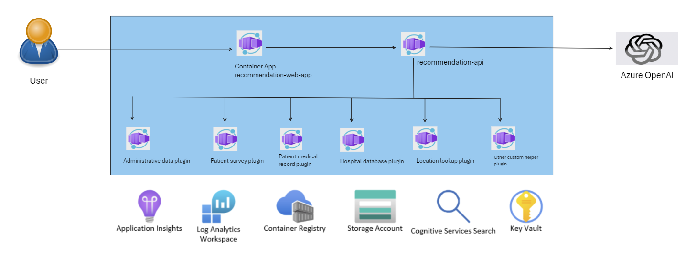

# Healio Healthcare Chatbot



This demo app demonstrates how to use C# & Semantic Kernel to orchestrate AI calls. In this example, we are building a healthcare chatbot (Healio). This chatbot needs to be able to answer common questions that customer support gets at hospitals helpdesk.

For example, a customer might ask "How can I schedule an appointment with Dr. Smith, who performed my surgery last month, for a follow-up checkup next week and look availability of doctor in nearest hospital in my network?". The chatbot needs to be able to understand the question and then answer it. The answer might be "Yes, Dr. Smith services are avilable in your network hospital and the nearest hospital [is this location]".

In order to do this, the code needs to be able to call several different data sources to answer the question.

1.  Adminstrative Data Plugin - includes information such as type of service, diagnosis and procedure codes, location of service, and amount billed and        reimbursed.
2.  Patient Survey Plug- self-reported information from patients about their health care experiences. It covers aspects such as satisfaction, quality, access, and outcomes of care.
3.  Patient Medical Record Plugin - contains rich clinical detail such as diagnoses, treatments, medications, lab results, and outcomes.
4.  Hospital Database Plugin - such as individual hospitals, doctor's schedule, hospital associations, state and regional data organizations, health departments, and federal agencies. It includes information such as hospital characteristics, performance measures, quality indicators, and patient outcomes.
5.  Location Lookup Plugin  - Find Hospital in network and nearest location
6.  Other custom support Plugin        - Any other support plugin you want to develop for additional data source or some mathematical calculations.

We need the `RecommendationAPI` to be able to call all of these APIs and then combine the results into a single answer. Semantic Kernel enables us to orchestrate these API calls via the StepwisePlanner. This planner will make multiple calls to the OpenAI service, make up its own plan to answer the question based upon the data & native plugins it has access to, then execute the plan.

## Disclaimer

**THE SOFTWARE IS PROVIDED "AS IS", WITHOUT WARRANTY OF ANY KIND, EXPRESS OR IMPLIED, INCLUDING BUT NOT LIMITED TO THE WARRANTIES OF MERCHANTABILITY, FITNESS FOR A PARTICULAR PURPOSE AND NONINFRINGEMENT. IN NO EVENT SHALL THE AUTHORS OR COPYRIGHT HOLDERS BE LIABLE FOR ANY CLAIM, DAMAGES OR OTHER LIABILITY, WHETHER IN AN ACTION OF CONTRACT, TORT OR OTHERWISE, ARISING FROM, OUT OF OR IN CONNECTION WITH THE SOFTWARE OR THE USE OR OTHER DEALINGS IN THE SOFTWARE.**

## Prerequisites

- [Azure CLI](https://docs.microsoft.com/en-us/cli/azure/install-azure-cli)
- [Azure Developer CLI](https://learn.microsoft.com/en-us/azure/developer/azure-developer-cli/overview)
- Azure subscription & resource group
- [Docker](https://docs.docker.com/get-docker/)

### Local development

- [.NET 8](https://dotnet.microsoft.com/download/dotnet/8.0)
- [Visual Studio 2022 Preview](https://visualstudio.microsoft.com/vs/preview/)
- [.NET Aspire](https://learn.microsoft.com/en-us/dotnet/aspire/get-started/aspire-overview)
  - Visual Studio (https://learn.microsoft.com/en-us/dotnet/aspire/fundamentals/setup-tooling?tabs=visual-studio)
  - CLI (https://learn.microsoft.com/en-us/dotnet/aspire/fundamentals/setup-tooling?tabs=dotnet-cli)
- [Dapr](https://dapr.io/)
- [Node.js with npm](https://nodejs.org/en/)

## Deployment

## Deploy to Azure

1.  Run the following command to deploy all services to Azure (building Docker containers, deploying Azure infrastructure & deploying web apps takes about 30 minutes).

    ```shell
    azd up
    ```

1.  Navigate to the URL specified in the command window (or go to the Web app container app in the Azure portal) and click the `Submit` button.


> [!NOTE]  
> Since this is using generative AI, there is no guarantee that the plan generated will exactly match the screenshots. You may have to run the demo several times to get it to output the desired result.

1.  After getting a response, click on the `Thought Process` button to see a diagram detailing the steps the planner took to answer the question.


## Run locally

1.  Set the following application settings to initialize the `RecommendationApi` (this assumes you already have the required Azure services such as OpenAI & Application Insights deployed). Customize as needed.

    ```shell
    cd src/RecommendationApi

    dotnet user-secrets init

    dotnet user-secrets set "OpenAI:Endpoint" "https://..."

    dotnet user-secrets set "OpenAI:ChatCompletionDeploymentName" "chat"
    
    dotnet user-secrets set "OpenAI:ChatCompletionModelId" "0613"

    dotnet user-secrets set "OpenAI:EmbeddingDeploymentName" "embedding"
 
    dotnet user-secrets set "OpenAI:EmbeddingModelId" "2"
    
    dotnet user-secrets set "OpenAI:ApiKey": ""

    dotnet user-secrets set "ApplicationInsights:ConnectionString" ""

    dotnet user-secrets set "EntraID:TenantId" ""

    dotnet user-secrets set "Cors:AllowedOrigins" "http://localhost:3000"
 
    ```

    >NOTE: The locally running demo defaults to using an API key to authenticate with the Azure OpenAI service. The version that runs in Azure uses a Managed Identity associated with the API Container App & Azure RBAC (`Cognitive Services OpenAI User` role) to authenticate with the Azure OpenAI service.`) 

1.  Run the following command to start the application.

    ```shell
    cd ..   
 
    dotnet run --project .\semantic-kernel-sleeping-bag.AppHost\semantic-kernel-sleeping-bag.AppHost.csproj
    ```

1.  Navigate to the following URLs to test the application.
    
    - [Web App](http://localhost:3000)
    - [Aspire dashboard (status of services)](http://localhost:15293) (NOTE: your port may be different, check the command window to be sure)
    - [Zipkin dashboard (view traces)](http://localhost:9411/zipkin)

## Links

- [Semantic Kernel](https://learn.microsoft.com/en-us/semantic-kernel/overview/)
- [Stepwise Planner](https://learn.microsoft.com/en-us/semantic-kernel/ai-orchestration/planners/?tabs=Csharp)
- [Azure OpenAI](https://learn.microsoft.com/en-us/azure/ai-services/openai/overview)
- [Azure Container Apps](https://learn.microsoft.com/en-us/azure/container-apps/overview)
- [Azure Developer CLI](https://learn.microsoft.com/en-us/azure/developer/azure-developer-cli/overview)
- [Aspire](https://learn.microsoft.com/en-us/dotnet/aspire/get-started/aspire-overview)
- [Dapr](https://dapr.io/)
